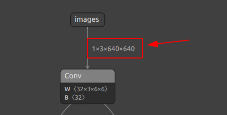
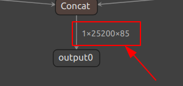
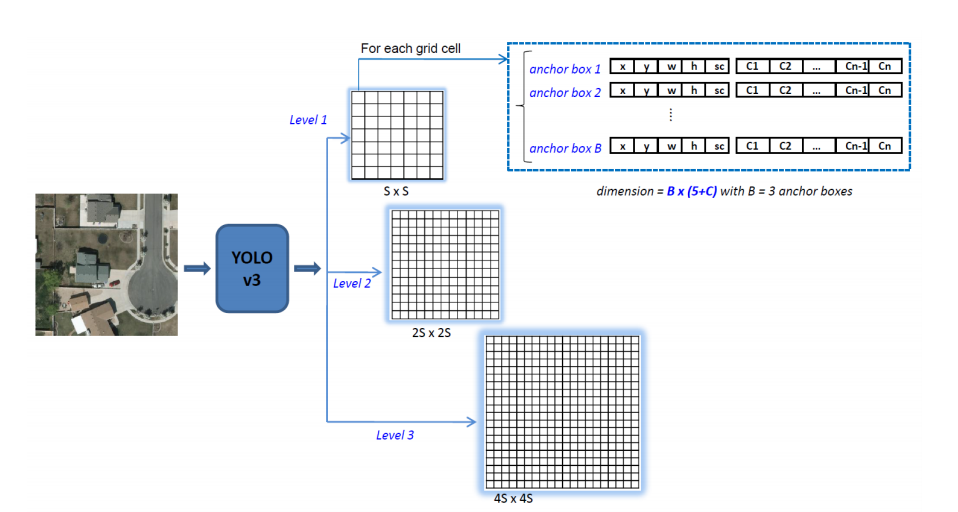
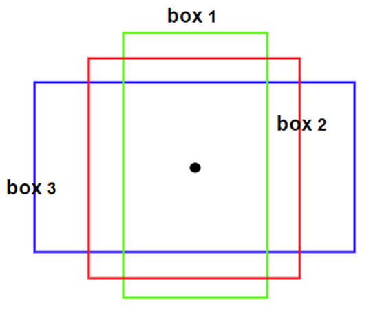
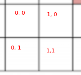
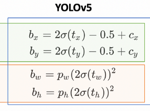

## yolov5输出解释--以yolov5s.pt为例
> 写在前面。这几天在用Tensort部署一个工训赛检测圆环的模型，发现输出怎么都对不上，通过查阅各方资料，便有了这篇文章，希望能帮助到大家
> 
## 输出维度
>在yolov5中，常见的输入为640*640,官方给出的yolov5s.pt正是如此，可以将其转换为onnx模型后在[Netron](https://netron.app/)上查看其输入与输出维度




可以看到输入维度为1×3×640×640,为CWH格式的输入，输出维度为1×25200×85

其中
* 1 为batch size也就是同时一次输入的图片数量
* 25200 为输出的预测框或者说预测单元的总数
* 85 为每个预测框所包含的信息，其中80为类别信息，4为坐标信息，1为置信度信息

实际上可以用这样的公式来表示,对于输入n×n的图像，用st作为浅层特征图步长，B作为每层的anchorBox的数量，C作为类别数量，那么输出维度为
$$
[1,\quad B\times((n / st)^{2}+ (n / 2st)^{2}+ (n / 4st)^{2}),\quad(5 + C)]
$$

为啥输出会是这样呢？下面介绍几个概念，然后再来解释，如果有错误欢迎评论区指正QVQ

## 概念解释
### 1. 特征图
> 特征图是指在卷积神经网络中，通过卷积层、池化层等操作后得到的图像，特征图的每一个像素点都是一个特征值，用来表示原始图像中的某种特征。

在yolov5中，分别使用步长(Stride)为[8, 16, 32]对图像进行下采样，得到三个特征图，分别为P3, P4, P5，对于640×640像素的输入，其大小分别为80×80, 40×40, 20×20。也就是(640, 640) / 8 ; (640, 640) / 16 ; (640, 640) / 32。

可以理解为将原图像分别分割为8份，16份，32份，然后将每份中的图片进行下采样作为新特征图中的一个像素点。每个网格或者说对应到特征图的像素点叫做一个<font color = red>*grid cell*</font>而每个特征图叫做一个<font color = red>*feature map*</font>。

yolov5的这个策略与yolov3一致，故使用v3的图来解释一下。



其中图中的S为深层特征图的大小，在本例中S=20。为啥要分这三种特征图呢？以我理解，由于要提升模型对不同大小物体的检测能力，使用三种特征图配合不同大小的anchorbox，既可以检测到大物体，也对小物体有不错的检测能力，泛化能力更好。

浅层特征图(80×80)适合用于检测小物体，因为其下采样的程度较小，可以保留更多的细节信息，可以想象一个很小的东西，如果下采样深度过高，它的信息可能就和巨多像素混在一起而丢失，因此较浅的下采样可以更好的留住小物体。深层特征图(20×20)适合用于检测大物体，因为其下采样的程度较大，对于大物体所占像素更多，若想获取其全部信息就需要采样更多的像素，因此可以更好的捕捉到大物体的特征。

### 2. AnchorBox
> AnchorBox(先验框)是指在目标检测中，预先定义好的一些具有不同形状和尺寸的框，用来对图像中的目标进行检测。在训练过程中，模型会根据AnchorBox的形状和尺寸来预测目标的位置和类别。

对于每个grid cell，我们去预测出在这个grid cell中物体可能出现的中心点以及物体的大小，这便是每个预选框的xywh参数。

注意预测的中心点xy并非直接表示为在原图中的像素坐标，而是相对于grid cell的偏移量，即在[0, 1]之间的值。而物体的宽高wh参数也是如此，他是相对于anchorbox的宽高的比例。

在分割好不同的特征图后，检测前我们预先定义好一组框的大小，然后在训练过程中，会将这些框的大小作为先验，然后不断调整wh这两个参数相对于anchorbox的比例，来预测物体的大小。

在yolov5s.pt中，对每一特征图使用了三种锚框(也就是anchorbox)，浅层为$[(10, 13),(16,30),(33,23)]$,中层为$[(30,61),(62,45),(59,119)]$,深层为$[(116,90),(156,198),(373,326)]$，不难看出，检测小物体的浅层的锚框尺寸较小，检测大物体的深层锚框尺寸较大，正好对应不同特征图检测不同大小物体的特点。




上图便是一个锚框的示例。至于锚框的数值是如何确定的，这个过程是由K-means或者其他聚类算法来确定的，通过对数据集进行聚类，选取好聚类中心个数，获得到具有代表性的聚类中心即可认为是可代表大部分物体大小的锚框大小，如果自己想修改anchorbox以适应自己所需的特殊场景可以去网络搜索如何修改。


由Netron给出的网络结构，可以看到经过各种操作，每个特征图的每个像素点(grid cell)都会预测出三个锚框的信息，也就是第二个维度3，至于第二个维度85是啥，下面便是。


### 3. 类别信息
> 类别信息是指在目标检测中，对目标进行分类的信息，通常用来解释目标是否是一个东西(置信度)以及是那一种东西(是那一种类别的概率)

我们不妨再看一眼Netron中网络的输出


不难看出最后的输出是由三部分合起来的。第一部分为(1×3×80×80×85),根据前面的概念，这个组成正好是$(batchSize × anchorBox数量 × 特征图大小 × 特征图大小 × 85)$，组成。这个85便是每个锚框的信息，其中80为类别信息，4为坐标信息，1为置信度信息，其构成便是$(5 + 类别信息)$

坐标信息即为四个预测数据
* 物体的中心点相对于该层特征图的某个grid cell左上角的偏移量
* 物体的宽高相对于anchorbox的宽高的比例

这里的相对于要使用官方给出的公式将预测数据转换为物体在原图像素坐标系中的数据，公式如下


其中$t_{x}, t_{y}以及t_{w}, t_{h}$为预测数据也就是原始的输出数据，$c_{x}, c_{y}$为grid cell在原图中的左上角坐标，$p_{w}, p_{h}$为anchorbox的宽高，$b_{x},b_{y},b_{w},b_{h}$即为物体在原图中的坐标信息。其中$\sigma()$函数代表对数据进行sigmoid操作。

需要注意到是这里的$c_x,c_y$，假设原图为40×40的像素，以步长为20划分gridcell，那么特征图的尺寸为2*2,则左上角grid cell的坐标为(0,0)，右上角grid cell的坐标为(20, 0)，左下角grid cell的坐标为(0, 20)， 右下角grid cell的坐标为(20, 20)。



这个步骤可以简化为将每个grid cell的边长设置为1，然后坐标就变为了grid cell的坐标 × 步长(stride),这样就可以直接得到grid cell在原图中的坐标。

置信度信息即为预测的物体是否存在的概率，这个概率是由模型预测出来的，通常来说，如果这个概率大于某个阈值，我们就认为这个物体存在，否则认为不存在。

类别信息的长度与训练时提供的分类类别有关。yolov5s.pt使用coco数据集进行训练，因此有着80个类别，因此类别信息的长度为80，每个数据代表该物体为该类别的概率，最后可以通过一些类似于argmax的操作取最大值来判断该物体的类别。

### 4. 总体解释
再回到开始给出计算维度的公式
$$
[1,\quad B\times((n / st)^{2}+ (n / 2st)^{2}+ (n / 4st)^{2}),\quad(5 + C)]
$$

就可以看出，第二维的数即为三种特征图上每个grid cell上的三个anchorbox的信息，三种特征图各有$(n / st)^{2}, (n / 2st)^{2}, (n / 4st)^{2}$个grid cell，每个grid cell上有B个anchorbox，因此最后获取了$B\times((n / st)^{2}+ (n / 2st)^{2}+ (n / 4st)^{2})$个预选框。

对于yolov5s.pt，n=640, st=8, B=3,计算出来正好是25200，也就是三种特征图上的预选框总数。对于自己训练的模型，一般可能有n不同，就像我想部署的检测圆环的模型输入n=320,那么第二维度信息相应变成了6300，也就是说有6300个预选框。

而对于每个预选框，包含着$(4 + 1 + C)$也就是xywh坐标信息，置信度，类别概率这些数据。想要利用这些数据，需要先利用公式把xywh转换到原图尺度，然后再根据置信度和类别概率去做后处理操作，比如NMS等等。

### 5. 代码实现
这里假设已经给出推理后的原数据，以c++中的数据结构`vector<vector<float>>`存储，其中第一维为预选框数量，第二维为信息数量，即为$(4 + 1 + C)$，下面给出一个简单的代码实现，将预测数据转换为原图坐标系中的坐标信息。

```cpp
using pairFloat = pair<float, float>
/*
 *  @brief 生成对应特征图各个grid cell的坐标
 *  
 *  @param width 特征图宽度
 *  @param height 特征图高度
 *  @param grids 生成的grid cell坐标
 * 
 *  @return void
 * 
 */
void makeGrid(int width, int height, vector<pairFloat> &grids)
{
    grids.clear();
    grids.resize(width*height);
    for(int y = 0; y < height ; y++)
    {
        for(int x = 0; x < width; x++)
        {
            int idx = y * width + x;
            grids[idx].first = static_cast<float>(x);
            grids[idx].second = static_cast<float>(y);
        }
    }
}
```
这个函数用于生成特征图上各个grid cell的坐标，注意的是在像素坐标系下的xy的表示，x表示横向坐标，y为纵向坐标。
同时先把公式贴在下面，假设数据已经经过sigmoid。



```cpp
using pairFloat = pair<float, float>;
using pairInt = pair<int, int>;
/*
 *  @brief 将预测数据转换为原图坐标系中的坐标信息
 *
 *  @param outputs 预测数据
 *  @param boxPos 预测数据xywh数据的起始偏移
 *  @param inputSize 输入图像大小
 */
void decodeOutput(vector<vector<float> &outputs, int boxPos, pairInt inputSize)
{
   /*每个特征图上各个grid cell的坐标,维度为grid[特征图层][gridcell索引]*/
    vector<vector<piarFloat>> grids; 
   /*划分特征图的stride*/
    const vector<int> stride{8, 16, 32}; // 注意一定要按顺序填！！！
    /*每层的anchorbox的大小*/
    const vector<vector<pairFloat>> anchorBox{
        {{10, 13}, {16, 30}, {33, 23}},
        {{30, 61}, {62, 45}, {59, 119}},
        {{116, 90}, {156, 198}, {373, 326}}
    };
    int nbLayers = 3;   // 特征图层数
    int nbAnchors = anchorBox[0].size(); // 每个grid cell上应用的anchor数


    int layerIdx = 0; // 特征图层索引,指向每层特征图的第一个框的位置

    for(int layer = 0; layer < nbLayers; layer++) // 遍历每层特征图
    {
        /*获取特征图大小*/
        int gridWidth = inputSize.first / stride[layer];
        int gridHeight = inputSize.second / stride[layer];
        int gridSz = gridWidth * gridHeight; // 该层特征图中所有grid cell数量
        int nbPredictions = gridSz * nbAnchors; // 该层特征图中所有anchorbox数量

        // 这里的判断其实不是很严格，按理说应当分别判断宽高是否分别一致
        // 若不一致或者为空，重新获取该曾特征图上每个grid cell的坐标，这里是长度为1的坐标
        if(grids[layer].empty() || grids[layer].size() != gridSz) 
        {
            makeGrid(gridWidth, gridHeight, grids[layer]);
        }
        for(int i = 0 ; i < nbPredictions; i++) // 遍历每个预选框
        {
            int currentRow = layerIdx + i; // 根据偏移找到对应框
            int currentGrid = i % gridSz; // 当前框在特征图中的位置
            int anchorIdx = i / gridSz; // 当前框使用的anchor索引
            /*为何这样取？一会再说*/

            outputs[currentRow][boxPos] = (outputs[currentRow][boxPos]*2 - 0.5 + grids[layer][currentGrid].first) * stride[layer];
            // grids[layer][currentGrid].first) * stride[layer] 即为公式中的cx，也就是gridcell在原图中的坐标
             outputs[currentRow][boxPos + 1] = (outputs[currentRow][boxPos + 1] * 2 - 0.5 + m_grids[layer][currentGrid].second) * m_strides[layer];

            outputs[currentRow][boxPos + 2] = pow(outputs[currentRow][boxPos + 2] * 2, 2) * m_anchorsGrids[layer][currentAnchor].first;
            outputs[currentRow][boxPos + 3] = pow(outputs[currentRow][boxPos + 3] * 2, 2) * m_anchorsGrids[layer][currentAnchor].second;
        }

    }

}
```
这样就结束了。最后解释一下
```c++
int currentRow = layerIdx + i; // 根据偏移找到对应框
int currentGrid = i % gridSz; // 当前框在特征图中的位置
int anchorIdx = i / gridSz; // 当前框使用的anchor索引
```
已知我们的数据是顺序排列的，而在生成输出的时候的数据是如何排列的的呢？我们再回到Netron中看一看：


排列顺序为1 × anchor数 × 特征图大小 × 特征图大小 × 每个框的信息

因此数据在顺序的排列中是这样来的


图中每一个块的大小均为gridSz，也就是特征图中grid cell的个数，对应这特征图中各个anchor所对应的数据。而一个特征图又有三个anchor，因此每个特征图所对应的总预选框的数量就是三个块。

上述代码中的layerIdx总是指向当前特征图的第一个块的第一个数据。因此currentRow便是当前预选框的数据的起始位置。对于每个特征图，有着3*gridSz个数据，因此使用 i / gridSz即可知道该位置的数据是属于哪个anchor的。而grid cell的编号在每个块中都是从0-gridSz的，因此使用i % gridSz即可知道该数据的grid cell编号。如果不理解可以仿照上述的结构写几组简单试试即可。

最后欢迎大家给我写的TensorRt框架点个star，阿里噶多QWQ。
[github地址](https://github.com/CrescentRoseSAMA/TRTFrame)